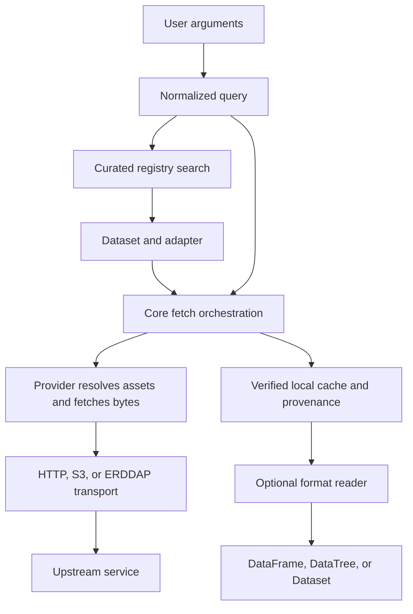

# Architecture

## Data flow



The core coordinates fetching and records provenance; providers supply dataset
knowledge, and protocols supply transport. Readers operate on local assets after
fetching. They are selected by format, independently of the transport used.


## Components

| Module | Responsibility |
|---|---|
| `models` | Pydantic types shared everywhere: `BBox`, `TimeRange`, `Dataset`, `Query`, `Asset`, `Provenance`. STAC-shaped: Dataset is a Collection, Asset is a file-level Asset. |
| `registry` | Loads the curated `data/registry.yaml`; keyword-ranked search filtered by provider, space, and time. |
| `query` | Turns loose user input (state/county names, FIPS, ISO dates, lat/lon) into a normalized `Query`. Place lookup uses `data/places.csv`. |
| `selection` | Pure start-time selection among supplied assets, with explicit temporal policy and match diagnostics. |
| `providers` | One `Provider` subclass per dataset, loaded by dotted path from the registry entry. Translates `Query` to agency-specific listing and download. |
| `testing` | The adapter contract as runnable checks: `check_provider_contract` holds any adapter, bundled or external, to the rules `providers` states. Imports pytest lazily. |
| `protocols` | Transport clients with no dataset knowledge. `http.download` streams to disk atomically; `s3.list_objects` paginates ListObjectsV2 anonymously. |
| `fetch` | Core loop: adapter resolves assets, cache is checked, bytes fetched, provenance written. |
| `readers` | Local CSV, radar, and NetCDF4 opening behind optional extras; format dispatch, units and source metadata, no fetching or cache writes. |
| `cache` | Cache directory resolution and content hashing. |
| `provenance` | Builds and persists a `Provenance` record beside each fetched file. |
| `manifest` | `Manifest` (declared inputs) and `Lockfile` (what was actually fetched, with checksums). |
| `pull` | Resolve a manifest through adapters and write the lockfile, or restore exactly what a lockfile pins; `verify` re-hashes against it. |
| `cli` | Typer app. Thin: argument parsing and exit codes only, no logic. |

Provider-specific knowledge (endpoints, auth, quirks) lives in `docs/providers/<id>.md`, not here.

`protocols/` holds transport clients shared by adapters. `http` streams
downloads; `s3` lists and reads public buckets over plain HTTPS with no AWS SDK.
`erddap` reads grid metadata/axes and builds coordinate-based CSV subset URLs. `fetch` is the core loop that ties adapter,
cache, and provenance together; the CLI calls it rather than adapters directly.

## Boundaries

- **Core never imports a provider.** Adapters are reached only through `load_adapter`, so new sources are additive.
- **Providers never touch the cache or write provenance.** They resolve queries to assets and fetch bytes to a path they are given. The core wraps that with caching and provenance so every source gets it for free.
- **The registry is data, not code.** Adding a dataset is a YAML entry plus an adapter class. Entries carry a `status`; planned ones have no adapter and exist so search, docs, and the roadmap agree.
- **Search is over the registry, not live catalogs.** See ADR 0001.
- **Heavy scientific dependencies are optional.** Core depends on pydantic, pyyaml, typer, and httpx. Anything that opens data (xarray, pandas, geopandas, Py-ART) lives behind extras.

Some things are deliberately out of scope. Decoding and analysis belong to
xarray and pandas, which readers hand off to rather than reimplement. Breadth
within one agency's data belongs to the libraries built for it, such as Herbie
for model output or dataretrieval for USGS; usdata owns one interface across
sources plus pinned, provenance-tracked inputs.

## CLI exit codes

| Code | Meaning |
|---|---|
| 0 | success |
| 1 | no results, a required manifest source is empty, or cached assets drifted |
| 2 | bad input (unknown dataset, place, or manifest error) |
| 3 | operation not implemented yet |
| 4 | upstream request failed |

## Failure boundaries

A manifest source must resolve to assets unless it sets `allow_empty: true`.
A failed resolution leaves an existing lockfile untouched, although earlier
successful downloads remain cached. Restore and verify both check the exact
manifest checksum before trusting its lockfile. Restore reports every pinned URL
whose bytes changed upstream in one run and rewrites pins only for entries the
caller explicitly selects with `update`. See the
[manifest reference](reference/manifests.md) for the reproducibility contract and
[ADR 0018](adr/0018-selective-lockfile-updates.md) for the decision.

`protocols.http.get` and `download` share a bounded retry policy for transient
GET failures. Metadata retries preserve the original request; download retries
restart with a new temporary file. Provider code uses these helpers with its
owned or injected client. Transport remains independent of dataset semantics.

`FetchedAsset.open()` delegates to `readers` on demand. It does not change models,
lockfiles, source bytes, or sidecars. Format selection uses the asset rather than
a current registry lookup, so restored results remain readable. See the
[reader reference](reference/readers.md) and [ADR 0006](adr/0006-optional-local-csv-readers.md).
Fetch trusts a cache hit whose sidecar checks pass and whose file has not been
touched since that sidecar was written, and hashes in every other case; restore
and verify still re-hash everything. See
[ADR 0024](adr/0024-trusted-cache-hits.md).

CLI progress uses private, synchronous events scoped by a context variable. Core
reports resolved batches and verified assets; HTTP reports bytes per attempt.
Providers and public SDK signatures are unchanged. Rendering is confined to the
CLI and disabled for redirected streams. See [ADR 0007](adr/0007-scoped-cli-progress.md).

HTTP-backed adapters share the public `providers.HttpProvider` lifecycle: clients
are created lazily, owned clients are closed on context exit, and injected clients
remain caller-owned. This helper carries no query, pagination, or dataset logic;
the public `Provider` interface remains transport-independent. `providers` exports
the whole adapter contract, and `usdata.testing` checks an adapter against it;
[ADR 0027](adr/0027-provider-contract.md) lists what is stable and what is not.

## Place table regeneration

`build_query(location=...)` resolves against `src/usdata/data/places.csv`, a
generated table of state and county bounding boxes. The
[Census cartographic boundary page](https://www.census.gov/geographies/mapping-files/time-series/geo/cartographic-boundary.html)
describes the source; the pinned archives are the 2025 1:500,000 KML files for
[states](https://www2.census.gov/geo/tiger/GENZ2025/kml/cb_2025_us_state_500k.zip)
and [counties](https://www2.census.gov/geo/tiger/GENZ2025/kml/cb_2025_us_county_500k.zip).

`scripts/build_places.py` reads the KML with the standard library and writes
the CSV plus `places.sources.json`, which records source URLs, archive SHA-256
hashes, counts, vintage, scale, and CSV checksum. No geospatial runtime
dependency or online geocoder is involved.

```sh
just places                           # download pinned 2025 archives and generate
just places --check                   # download and compare with committed outputs
just places --source-dir /path/to/zips --check  # reproduce offline from saved archives
```

Never hand-edit the CSV. Updating the vintage means updating the generator,
the expected coverage tests, the places reference, and the changelog. Ordinary
CI validates bundled counts, unique FIPS, valid bounds, aliases, and the CSV
checksum without network access; regeneration is an explicit maintenance task.
See [ADR 0005](adr/0005-generated-census-place-envelopes.md).
