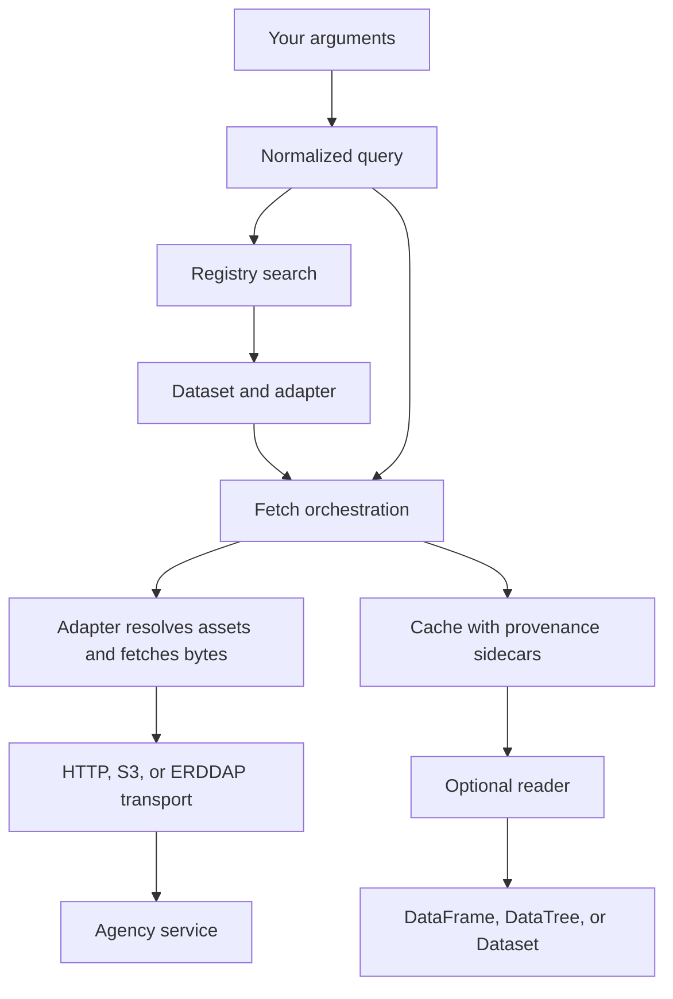

# How usdata works

usdata does four things in order: find a dataset in a curated registry,
fetch its files unchanged, keep them in a local cache with a provenance record
each, and open them with an optional reader. Manifests and lockfiles make the
first three repeatable.

## The pieces

**The registry** is a curated list of datasets: real ids, real endpoints, and
true capabilities. `search` ranks it by keyword, filtered by provider, place,
and time, entirely offline. It never queries an agency's live catalog, so a
search result is a promise the adapter can keep.

**A query** is your arguments normalized: a place name or FIPS code becomes a
bounding rectangle, dates become UTC instants, and provider options go in
`params`. The same query object drives the CLI, the SDK, and a manifest source.

**An adapter** exists per dataset. It turns the query into the agency's own
listing and download requests and returns whole files, exactly as the agency
serves them. It rejects what the source cannot honour, such as free text or a
variable filter on a whole-file archive, before any request is made.

**Transport** is shared by adapters and knows nothing about datasets: plain
HTTPS downloads streamed to disk, anonymous S3 listings over HTTPS with no AWS
SDK, and ERDDAP coordinate subsets.

**The cache** holds one current file per asset id under `~/.cache/usdata/` or
`USDATA_CACHE_DIR`, each with a provenance sidecar. Only the core writes
there. A second fetch of the same asset is a cache hit checked against that
sidecar, and re-hashed only when the file has been touched since it was written.

**Readers** open a cached file into pandas or xarray behind optional extras.
Without the extra you still have the file, its path, and its provenance.

**Manifests and lockfiles** declare which queries a project needs and pin the
exact bytes those queries produced, so the download can be repeated and the
result checked.

## Boundaries you can rely on

- Search never contacts an agency. Only `fetch`, `pull`, and `--dry-run` do.
- An adapter never writes to the cache or provenance. It resolves assets and
  writes bytes to a path it is given; the core wraps that with caching and
  provenance, so every dataset gets both.
- A reader never fetches, verifies checksums, converts units, or changes the
  cached file. Opening is a local step you can repeat.
- Files are never rewritten. Gzip archives are decompressed in memory when
  opened; the cached bytes stay as published.
- Heavy scientific libraries stay behind extras. The core depends only on
  pydantic, PyYAML, Typer, and httpx.

## CLI exit codes

| Code | Meaning |
|---|---|
| 0 | Success. |
| 1 | No results; a required manifest source resolved to nothing; or `verify` found a cached file missing or changed. |
| 2 | Bad input: unknown dataset or place, a rejected query, or a manifest that does not match its lockfile. |
| 3 | The dataset is planned and has no adapter. |
| 4 | An upstream request failed, or a locked restore found pinned bytes changed upstream. |

Transient upstream failures are retried a bounded number of times before code
4; the numbers are in the [manifest reference](../reference/manifests.md#failures-and-retries).
