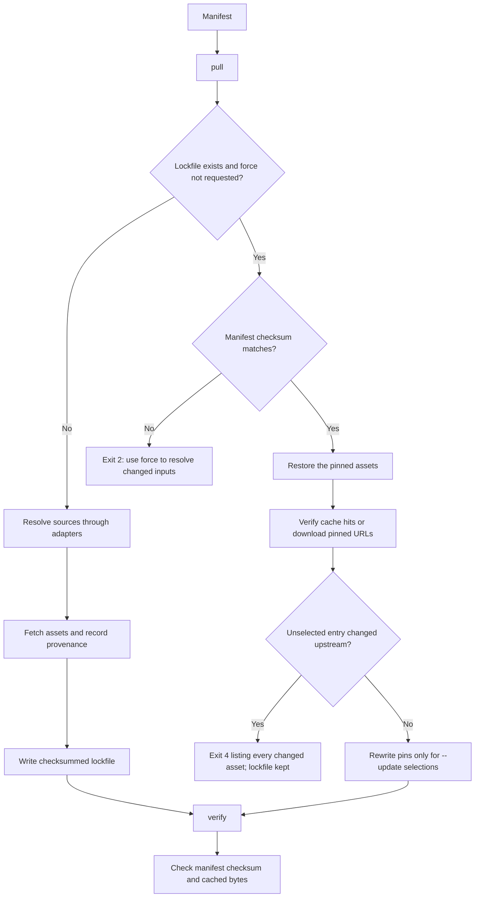

# Manifests and lockfiles

A manifest is a small YAML file that declares the datasets a project needs, as
queries. A lockfile records what those queries actually produced: the resolved
asset URLs, their checksums, and their provenance. Commit both. The cache holds
the bytes themselves and should be backed up separately when long-lived
reproducibility matters.

```yaml
name: first-station
sources:
  - dataset: noaa:ghcn-daily
    start: 2024-05-06
    end: 2024-05-07
    variables: [PRCP, TMAX]
    params:
      stations: USW00013967
```

The [manifest reference](../reference/manifests.md) lists every field and each
dataset's provider options. This page explains what pull, restore, and verify
do with them.

## Pull, restore, and verify

The first `pull` resolves each source through its adapter, downloads the
assets that are not already cached, and writes `dataset.lock.json` beside the
manifest. Every required source must resolve to at least one asset; otherwise
pull exits 1 and leaves any existing lockfile untouched, although files fetched
before the failure stay cached for the next attempt. A source that may
legitimately resolve to nothing says so with `allow_empty: true`. Resolution
checks that assets exist, not that a returned file contains every observation
you hoped for.

With a lockfile present, `pull` becomes a restore. It does not repeat
discovery: it takes each pinned URL, checks whether the cached bytes match the
pinned checksum, and downloads only what is missing or altered. Restoring into
an empty directory on another machine is the same command with `--cache-dir`.

`verify` is offline. It checks that the manifest still matches the checksum in
the lockfile, then hashes every cached file against its pin. It exits 0 when
all match, 1 when a file is missing or changed, and 2 when the manifest or
lockfile is unreadable or mismatched. It does not query upstream and it says
nothing about the scientific meaning of the data.



## Naming sources

A source may carry a `name`: a short label of letters, digits, hyphens, and
underscores, unique within one manifest. Names make a result addressable when
indexing `fetched` by position would be fragile, which is the usual case once
two sources read the same dataset.

```yaml
name: cedar-key-helene-surge
sources:
  - name: surge
    dataset: noaa:coops-water-levels
    start: 2024-09-25T00:00:00Z
    end: 2024-09-28T00:00:00Z
    params: { station: "8727520", datum: MLLW, units: metric }
  - name: tide
    dataset: noaa:coops-tide-predictions
    start: 2024-09-25T00:00:00Z
    end: 2024-09-28T00:00:00Z
    params: { station: "8727520", datum: MLLW, units: metric, interval: "6" }
```

```python
from pathlib import Path

from usdata import pull

result = pull(Path("dataset.yaml"))
(observed,) = result.by_source["surge"]
(predicted,) = result.by_source["tide"]
```

`fetched` holds every asset in manifest order, then in the order the adapter
listed that source's assets. `by_source` holds the same objects grouped by
source key, which is the `name` when a source has one and its one-based
position (`"1"`, `"2"`) when it does not. The lockfile records the key beside
each pinned asset, so a restore rebuilds the same grouping without re-resolving
anything. Lockfiles written before keys existed still load; their entries group
by dataset id in manifest order instead, so name the sources and re-run
`pull --force` to refresh the mapping.

## Changing the manifest

The lockfile stores a checksum of the manifest's exact bytes. Editing the
manifest, including whitespace or a comment, makes pull and verify refuse it
with exit code 2 until you re-lock with `pull --force`. That re-runs discovery
for every source and replaces the lockfile once all required sources succeed;
valid cached files are still reused. An intentionally empty optional source is
pinned as no assets, and restore does not look for newly available results
until you force a re-resolve.

`--force` on `pull` and `--force` on `fetch` mean different things. On pull it
re-resolves queries and replaces the lockfile. On fetch it re-downloads a file
even when the cache already has a valid copy. Neither is a guarantee of
upstream freshness.

## When upstream changes

A restore that finds different bytes at a pinned URL does not stop at the first
one. It continues through every entry, restores those that still match, leaves
any existing file in place for those that changed, exits 4 with the full list,
and keeps the lockfile as it was. Accepting a change is a deliberate, selective
step, described in [provenance and drift](provenance-and-drift.md).

--8<-- "_snippets/upstream-revisions.md"
