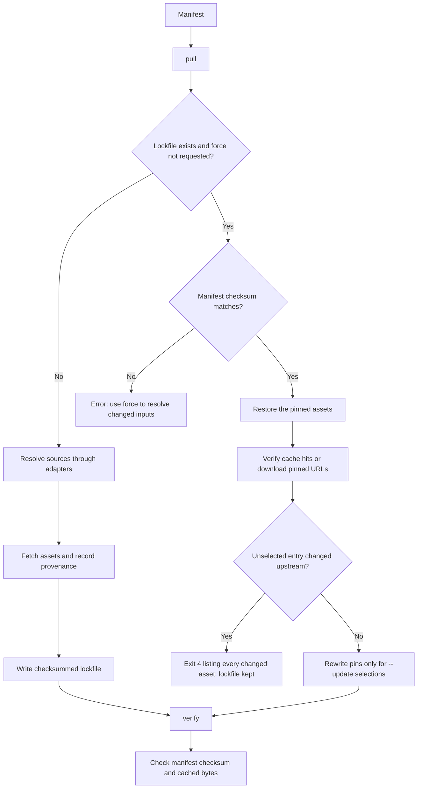

# Manifests and reproducible inputs

A manifest declares the datasets needed by a project. Commit it together with
its lockfile. The cache holds the downloaded bytes and should be backed up
separately when historical reproducibility matters.

Start with the [NOAA and USGS example](../examples/weather-and-streamflow/README.md).
Installation and development setup are in the [README](https://github.com/jakeryderv/usdata/blob/main/README.md).

## Manifest fields

```yaml
name: weather-and-streamflow
version: "1.0"
sources:
  - dataset: noaa:ghcn-daily
    start: 2024-05-06
    end: 2024-05-07
    variables: [PRCP, TMAX]
    params:
      stations: USW00013967
      units: metric
```

| Field | Meaning |
|---|---|
| `name` | Required project/input-set name. |
| `version` | Manifest format label, default `"1.0"`. Currently informational; use `"1.0"`. It is not the package or dataset version. |
| `sources` | Required, non-empty list of source specifications. |

Each source accepts:

| Field | Meaning |
|---|---|
| `dataset` | Required registry ID, such as `usgs:water-daily`. |
| `location` | A bundled place name or alias. Mutually exclusive with `bbox`. |
| `bbox` | WGS84 box with `west`, `south`, `east`, `north` fields. |
| `start`, `end` | ISO dates or datetimes. Most adapters require both; climate normals make them optional and HURDAT2 rejects them. |
| `variables` | List of dataset-specific variable names/codes. Quote numeric codes to retain leading zeros. |
| `params` | Mapping of provider-specific options, listed below. Unknown adapter options are errors. |
| `allow_empty` | Default `false`. Set `true` only if this source is intentionally optional when its query resolves to no assets. |

Unknown manifest and source fields are rejected. `params` must not repeat
`location`, `bbox`, `start`, `end`, or `variables`.

Place lookup uses 2025 Census bounding boxes for 56 states/DC/territories and
3,235 counties/equivalents. Use names/postal codes, `"Cleveland County, OK"`, or
quoted FIPS such as `"40027"`. Rectangles can include points outside the actual
boundary. Alaska and other antimeridian-spanning regions have very wide boxes;
prefer explicit station IDs or a local bbox there. See the
[place reference](places.md) for aliases, source vintage, and limitations.

## Provider options

`usdata info <dataset>` prints the same parameter names with a one-line
description each, read from the adapter that accepts them, so the accepted set
is always discoverable from the command line. The table below adds the detail
that does not fit on one line.

| Dataset | `params` | Variables and time |
|---|---|---|
| `noaa:ghcn-daily` | `stations`: non-empty comma-separated string or list; otherwise requires a geographic query. `units`: `metric` (default) or `standard`. Explicit stations take precedence over geographic selection. | Names such as `PRCP`, `TMAX`; inclusive calendar dates, time of day ignored. |
| `noaa:gsom` | `stations`: non-empty comma-separated string or list, or a geographic query; do not combine them. `units`: `metric` (default) or `standard`. | Names such as `PRCP`, `TAVG`; every UTC calendar month touched by the interval is selected in full. |
| `noaa:gsoy` (v0.10.0) | `stations`: non-empty comma-separated string or list, or a geographic query; do not combine them. `units`: `metric` (default) or `standard`. | Names such as `PRCP`, `TAVG`; every UTC calendar year touched is selected in full. Annual labels do not imply identical accumulation seasons for all elements. |
| `noaa:climate-normals` (v0.11.0) | `period`: `monthly` (default), `daily`, or `annualseasonal`. `stations`: non-empty comma-separated string or list, or a geographic query; do not combine them. `units`: `metric` (default) or `standard`. | NCEI data type codes such as `MLY-TMAX-NORMAL`; unknown codes yield empty columns. Dates optional. For daily and monthly, both dates select a month-day window inside placeholder year 2020 and may not cross the new year; annualseasonal rejects dates. Asset time bounds are the 1991-2020 normals period. |
| `noaa:nexrad-level2` | `site` or `sites`: radar IDs, mutually exclusive. Alternatively `nearest`: positive integer with a geographic query. Do not combine `nearest` with explicit IDs. | Whole scans, without variable subsetting. UTC timestamps; both interval bounds included. A date-only end means midnight at the start of that day. |
| `noaa:goes-abi` | Required `satellite`: 16, 17, 18, or 19, and `channel`: 1–16 or `C01`–`C16`. Optional `product`: only `ABI-L2-CMIPC` (default). Geographic selection is rejected. | Complete single-channel CONUS scenes selected by inclusive UTC scan-start time; both timestamps required. Date-only values mean midnight. Variable subsetting is rejected; select a channel instead. |
| `noaa:coops-water-levels` | Required string `station` and `datum`; optional `units=metric` or `english`. | Available since v0.10.0. Six-minute observations only. Both bounds required, UTC, minute precision, inclusive, at most 28 days. No geographic/text/variable selection. No-data API responses fail on fetch; `allow_empty` cannot suppress them. |
| `noaa:storm-events` | No provider parameters or geographic selection. | Both dates required; every UTC calendar year touched by the interval selects its latest supported annual details archive in full. Variable subsetting is rejected. Filter rows locally after opening the gzip CSV; report times retain their source timezone labels. |
| `noaa:hurdat2` (v0.12.0) | `basin`: `atlantic` (default) or `pacific`, case-insensitive. No other params and no geographic selection. | Whole-basin best-track text; the newest revision wins. Dates are rejected, not ignored: every revision holds the complete record. Variable and text filters are rejected. Filter the parsed track points locally. |
| `noaa:coastwatch-sst` | Requires a bbox or location. `stride`: positive integer, default 1, subsamples both spatial axes. At most 1,000,000 grid rows per request. | `analysed_sst` (default), `analysis_error`, `sea_ice_fraction`, `mask`. Inclusive UTC timestamps; date-only values mean midnight. CSV retains coordinate columns and the units row. |
| `usgs:water-daily` | `site` or `sites`: quoted monitoring IDs, mutually exclusive. Alternatively a geographic query. `statistic_id`: quoted five-digit code, default `"00003"` (daily mean). Explicit sites and a geographic filter both apply when present. | Quoted parameter codes such as `"00060"`; inclusive local calendar dates, time of day ignored. |

Plural `stations`/`sites` options accept strings or lists of strings; see each
row for singular aliases. CO-OPS `station` requires one seven-digit string and
does not accept a list. NOAA radar IDs are
case-insensitive. USGS IDs may include the `USGS-` prefix. Empty explicit lists
are invalid even with `allow_empty: true`; that flag permits an empty result
from a valid query.

See [NOAA](../providers/noaa.md) and [USGS](../providers/usgs.md) for source
behavior, units, limitations, and endpoint details.

## Pull, refresh, and restore

In Python, pass `pathlib.Path` objects to `pull()` and `verify()`, for example
`pull(Path("dataset.yaml"))` after `from pathlib import Path`. Their manifest-path
arguments do not accept strings. CLI paths are ordinary command-line arguments.

```sh
usdata pull dataset.yaml --cache-dir .data
usdata verify dataset.yaml --cache-dir .data
```

The first pull resolves each source, downloads missing assets, and writes
`dataset.lock.json`. Every required source must resolve to at least one asset;
otherwise pull exits 1 and does not create or replace the lockfile. Files
successfully fetched before the failure remain cached for the next attempt.
This checks asset presence, not completeness of all scientific observations
inside a returned file.

With a lockfile present, pull restores the pinned assets without re-querying
listings. Cached bytes must match their pinned checksums; missing or altered
files are downloaded again. If upstream now returns different bytes for a pinned
URL, restoration continues through the remaining entries, then exits 4 listing
every asset that changed. Assets that still match are restored; changed ones keep
any existing file at that path, and the lockfile is not rewritten.

To accept what upstream serves now for specific entries, name an asset id from
that report or a dataset id:

```sh
usdata pull dataset.yaml --cache-dir .data --update noaa:ghcn-daily
usdata pull dataset.yaml --cache-dir .data --update daily-summaries_2024-05-06_2024-05-07_719b6aa75cfc.csv
```

`--update` re-downloads the selected entries from their pinned URLs and rewrites
only their checksums and provenance. It does not re-run discovery, so listing-based
sources keep the same files. Entries whose bytes are unchanged keep their existing
pin, so the lockfile diff shows only real changes. Every unselected entry must
still match; otherwise the run exits 4 and nothing is rewritten. Selectors that
match nothing, `--update` with `--force`, and `--update` without a lockfile exit 2.
In Python, pass `update=["noaa:ghcn-daily"]` to `pull()`; a run with unaccepted
changes raises `UpstreamChanged`, whose `drift` lists each asset.

If the manifest changes, both pull and verify refuse it with exit code 2:

```sh
usdata pull dataset.yaml --cache-dir .data --force
```

For **pull**, `--force` re-resolves queries and replaces the lockfile after all
required sources succeed. Valid cached responses may still be reused. For
**fetch**, `--force` means re-download even a valid cached file. These flags
have different purposes; re-locking is not a guarantee of upstream freshness.
`--update` sits between them: it keeps the resolved asset list and refreshes
bytes for chosen entries only.

The manifest checksum covers its exact bytes. Editing whitespace or comments
also requires re-locking. An intentionally empty optional source is pinned as
no assets; restore does not search for newly available results. Use `pull --force`
to resolve it again.

## What verification guarantees

`verify` is offline. It checks that the manifest matches the lockfile, then
hashes the cached files. It exits 1 if a file is missing or has changed, 2 for
an invalid/mismatched manifest or unreadable lockfile, and 0 when checks pass.
It does not query upstream or validate the scientific meaning of the data.
An older empty lockfile cannot prove that all original queries were satisfied;
re-resolve it using the current empty-source policy.

Lockfiles contain the manifest checksum, generation time, usdata version,
resolved asset URLs, file checksums, and provenance. Sidecars record source URL,
provider, dataset, retrieval time, byte count, checksum, and license.

**A lockfile detects changed data; it does not archive data.** Query-based APIs
may revise observations or page ordering and may not expose historical
versions. If both the cached bytes and their upstream version are gone, usdata
cannot recreate them. Preserve the cache alongside the manifest and lockfile
for long-lived work. The cache stores one current file per asset ID; it is not
a versioned archive.

## Failures and retries

GET requests retry transient connection, timeout, and remote protocol failures,
as well as HTTP 429, 500, 502, 503, and 504, for at most three attempts. Default
backoff is 0.5 then 1 second. `Retry-After` seconds and HTTP dates are respected;
a requested wait over 30 seconds is surfaced as an error instead of retried early.
Interrupted downloads restart from the beginning in a temporary file. Permanent
HTTP errors, local filesystem failures, and checksum mismatches are not retried.

CLI exit codes: 0 success; 1 no assets or verification drift; 2 invalid input;
3 unimplemented dataset; 4 upstream or checksum failure. Offline tests prohibit
network connections; live tests exercise upstream services separately.

## Resolve, restore, and verify



Locked restoration avoids repeating discovery. Verification checks local
integrity; neither operation can recreate upstream bytes that are no longer
available. Preserve cached inputs for long-lived reproducibility.
